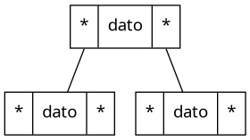
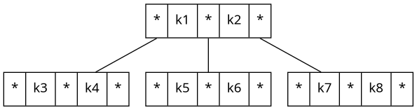

# Arboles

Algoritmos y Estructuras de Datos (CB100) - FIUBA  
Martin Klöckner - [mklockner@fi.uba.ar](mailto:mklockner@fi.uba.ar)  

\vspace{-1.25em}
\rule{\linewidth}{0.5pt}
\vspace{-1.25em}

Un árbol es una estructura de datos que posee ramificaciones pero no sigue con
una estructura lineal, como las listas enlazadas por ejemplo (salvo en casos
particulares) en esta estructura es posible poseer mas de una posición
siguiente, aunque típicamente se tienen dos (arboles binarios). Un árbol
obligatoriamente debe cumplir que cada nodo tenga un solo padre.

Dentro de la estructura se asigna diferentes nombres a los nodos con diferentes
características, como la **raíz**, el cual es el nodo que no tiene
"ancestros" y la **hoja** que es un nodo que no tiene hijos. Otras definiciones
incluyen el **grado** que es el numero de hijos que tiene un subárbol o nodo, y
la **altura** de un nodo que es la longitud del camino mas largo desde el nodo a
la raíz (por convención la raíz tiene altura 1).

En la figura 1 se muestra varios ejemplos de arboles. Tomando como ejemplo el
árbol binario de la figura 1.3, la raíz es el nodo A, las hojas los nodos D, E,
F y G, el grado de la raíz 2 y la altura 3.

{ width=28% }
\hspace{3em}
{ width=28% }
\hspace{3em}
{ width=28% }

\vspace{-1em}
\begin{figure}[!h]
\begin{subfigure}[t]{0.3\textwidth}
\caption{Árbol binario}
\end{subfigure}
\hspace{2em}
\begin{subfigure}[t]{0.3\textwidth}
\caption{Árbol de búsqueda binario}
\end{subfigure}
\hspace{2em}
\begin{subfigure}[t]{0.3\textwidth}
\caption{Otro ejemplo de árbol binario}
\end{subfigure}
\vspace{-0.30em}
\caption{Ejemplos de arboles binarios}
\end{figure}
\vspace{-0.50em}

Un ejemplo de la implementación típica de un nodo de un árbol binario se puede
ver en la figura 2, en la cual cada nodo tiene un dato asociado que almacena y a
su vez una referencia al nodo izquierdo y derecho que le preceden.

<!-- { width=40% } -->

{ width=30% }
\hspace{1em}
{ width=65% }

\vspace{-1em}
\begin{figure}[!h]
\begin{subfigure}[t]{0.3\textwidth}
\caption{Árbol binario}
\end{subfigure}
\hspace{3em}
\begin{subfigure}[t]{0.6\textwidth}
\caption{Árbol B, k* representa una clave o dato almacenado}
\end{subfigure}
\vspace{-0.30em}
\caption{Estructura de nodos de arboles}
\end{figure}
\vspace{-0.50em}

## Arboles de búsqueda binario

Un árbol de búsqueda binario o ABB por sus siglas, es un árbol binario, es decir
que tiene un máximo de dos hijos por cada nodo, pero que además está ordenado,
esto es, el nodo izquierdo contiene un dato menor en comparación con el nodo
actual, y el nodo derecho un dato mayor en comparación. Un ejemplo de un árbol
de búsqueda binario se puede ver en la figura 1.2

Tener un árbol binario ordenado permite reducir el numero de pasos requeridos
para encontrar un dato almacenado en el árbol. Los ABB deben cumplir que el dato
de la raíz sea mayor al dato de todos los valores almacenados en los nodos hijos
del nodo izquierdo y menor a todos los datos almacenados en los hijos del lado
derecho. En el mejor de los casos la altura de un ABB es $log(n)$ y en el peor
de los casos la altura es $n$, esto ultimo en este tipo de arboles ABB determina
el tiempo mínimo y máximo para acceder a un nodo[^1] (el peor de los casos que es
cuando el dato esta en una hoja).

[^1]: Abdul Bari. (2018, Marzo 16).  10.1 AVL Tree - Insertion and Rotations.
    [https://www.youtube.com/watch?v=jDM6_TnYIqE&t=239s](https://www.youtube.com/watch?v=jDM6_TnYIqE&t=239s).

### Maneras de recorrer un árbol binario

Existen varias formas de recorrer un árbol binario siendo las mas típicas
Depth-First Search (DFS o recorrido en profundidad) y Breath-First Search (BFS o
recorrido en anchura). En la primera (recorrido en profundidad) se puede
realizar en preorden, inorden o postorden; para la segunda típicamente se
recorren los nodos por niveles.

Para la manera en profundidad (Depth-First Search), en el recorrido en preorden,
primero se accede a la raíz, luego al nodo izquierdo y luego al derecho, si
alguno de los nodos es un subárbol entonces se realiza el mismo procedimiento.
Para el recorrido inorden, primero se accede al nodo izquierdo, luego a la raíz,
y por ultimo al nodo derecho, este recorrido típicamente se usa en arboles de
búsqueda binarios (ABB). Por ultimo en el recorrido postorden, primero se accede
a ambos nodos, izquierdo y derecho, y luego a la raíz.

Para la manera en anchura (Breath-First Search), se recorre el nodo en orden por
niveles de arriba hacia abajo y de izquierda a derecha, es decir, primero la
raíz, luego todos los nodos, luego los nodos de los nodos, y así sucesivamente.

Por ejemplo, en el árbol de la figura 1.3, el recorrido utilizando los 4 métodos
mencionados resultan: 

* Preorden: A B D E C F G
* Inorden: D B E A C F G
* Postorden: D E B F G C A 
* Nivel por nivel: A B C D E F G

### Características de los arboles

#### Árbol lleno

Se dice que un árbol esta lleno, si todas las hojas tienen el mismo nivel y
todos los nodos anteriores tienen el numero máximo de hijos (en un árbol binario
2), por ejemplo el árbol de la figura 1.3 está lleno, los arboles de las figuras
1.1 y 1.2 no están llenos ya que las hojas no tienen el mismo nivel (hay hojas
de nivel 2 y 3 en ambos casos).

#### Árbol completo

Se dice que un árbol esta completo, si todas sus hojas están llenas sin contar
contar el ultimo subárbol, es decir, puede haber alguno hoja vacía y además
todas las hojas están lo mas a la izquierda posible, es decir, las posibles
hojas vacías están a la derecha de la raíz del nodo, y se van completando de
izquierda a derecha. En los arboles de las figuras solo 1.3 cumple, para que 1.1
y 1.2 cumplan deberían estar completos de izquierda a derecha y no ocurre.
A un árbol que no esta completa también se le dice desequilibrado.

#### Árbol balanceado

Un árbol se dice balanceado si para cada nodo la diferencia de alturas entra el
subárbol izquierdo y derecho es pequeña, típicamente menor a $\left|1\right|$

#### Árbol degenerado o patológico

Un árbol degenerado (también llamado árbol patológico) es un tipo especial de
árbol en el que cada nodo tiene a lo sumo un hijo. Es decir, se comporta como
una lista enlazada en lugar de un árbol ramificado. Esto ocurre por ejemplo al
insertar datos ordenados en un ABB.

#### Factor de equilibrio

El factor de equilibrio se define para cada nodo como la diferencia entre las
alturas del nodo derecho e izquierdo (el sentido opuesto, es decir, la
diferencia del izquierdo y el derecho también vale, pero se debe respetar la
convención elegida para todo el árbol).

$$\boxed{F_{equilibrio} = h_{derecho} - h_{izquierdo}}$$

### Árbol AVL (Adelson-Velski y Landis)

Un árbol AVL, es una caso particular de un árbol de búsqueda binario en el que
cada vez que se inserta o elimina un nuevo elemento se lo hace de manera que el
árbol resulte balanceado, esta es una mejora a los ABB ya que si se insertan los
datos ordenados el árbol se degenera. Para que el árbol resulte balanceado al
insertar o eliminar un elemento cada vez que se realiza dicha operación se
comprueba si el árbol resulta equilibrado, en caso de que no se lo balancea.

#### Algoritmos de rotación

Las rotaciones se realizan para balancear arboles AVL. El punto clave es
entender que las rotaciones se aplican solo a 3 nodos y modifican los nodos
hijos.

##### Rotación simple a derecha

##### Rotación simple a izquierda

##### Rotación doble a derecha

##### Rotación doble a izquierda

## Árbol B

Los arboles B surgen como una forma de hacer mas eficiente la lectura y
escritura en disco de datos, en particular de decrementar el tiempo y la
cantidad de bloques leídos de un disco a la hora de buscar un dato>

Lo particular de los arboles B en comparación a los arboles binarios vistos
anteriormente es que tienen un numero mayor de datos almacenados y un numero
mayor de hijos, pero se sigue la convención de los arboles de búsqueda binarios
en que los datos a la izquierda son menores y a la derecha mayores, tanto en los
nodos como en las claves.

Los arboles B tienen las mismas operaciones que los arboles binarios y aparte la
operación de dividir y fusionar.

## Árbol B+

Los arboles B+ son muy similares a los arboles B pero con la condición que los
datos deben estar en las hojas, y por esto para mantener la estructura de árbol,
se copian los datos de las raíces a las hojas. Además se impone la condición de
que todas las hojas deben estar conectadas, de forma de que todas las hojas
formen una especie de lista enlazada.

## Colas con prioridad

Las colas con prioridad es una estructura de datos de tipo cola pero tienen la
particularidad que al momento de insertar un elemento se puede asignar una
prioridad, de manera que se inserte con un orden de prioridad.

Existen varias maneras de implementar una cola con prioridad, por ejemplo un
vector, una lista enlazada o un árbol heap.

## Árbol heap

Los arboles heap son una particularidad de los arboles binarios, en los cuales
se busca que siempre estén completos y parcialmente ordenados, esto se hace
insertando los elementos de derecha a izquierda por niveles. Una vez insertado
el elemento se compara e intercambia con el padre hasta mantener la relación
mayor-menor según el tipo de árbol heap.

Y entre nodos del mismo nivel no existe una relación particular.

Los arboles heap típicamente se almacenan en vectores.

### Árbol heap de máximo

En el árbol heap de máximo los datos en los padres son siempre mayor que los
datos almacenados en los hijos.

### Árbol heap de mínimo

En los arboles heap de mínimo ocurre al revés que en los arboles heap de máximo,
es decir, los datos almacenados en los padres son siempre menor que los datos
almacenados en los hijos.
