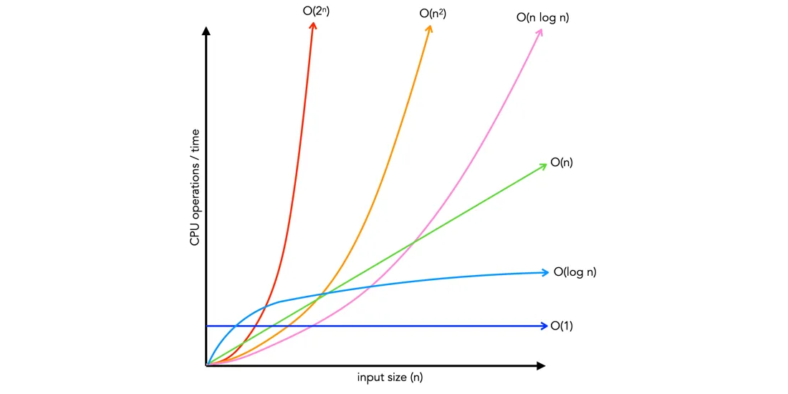

# Complejidad Algorítmica

\tableofcontents

Se dice que un algorítmico es mas eficiente que otro si consume menos recursos.
La eficiencia se puede medir en términos espaciales (cantidad de memoria
estática y dinámica que utiliza al ejecutarse) o en términos temporales (el
tiempo que tarda en ejecutarse) en general se busca una relación de compromiso
que comprende ambos factores.

Cuando se hace un análisis de la complejidad temporal de un algoritmo, se hace
referencia al tamaño de entrada del problema, o tamaño del problema, este tamaño
depende de la naturaleza del problema y corresponde a aquel o aquellos elementos
que produzcan, al crecer, un aumento en el tiempo de ejecución. Por ejemplo, al
calcular el factorial de un número, el tamaño del problema es el número al cual
se quiere calcular el factorial, ya que cuanto mayor sea este número mayor será
el tiempo de ejecución del algoritmo, otro ejemplo es el caso de una búsqueda
binaria en la cual el tamaño del problema será el tamaño del vector a ordenar.

Se denota entonces la complejidad algorítmica para una operación de `n` entradas
como `T(n)`, esta complejidad algorítmica mide el número de operaciones
elementales, y si bien al analizar un algoritmo existe un mejor caso, un caso
promedio y un peor caso, en la practica se suele definir a `T(n)` en términos
del peor caso, ya que determina cual sería el número de operaciones elementales
requeridas con la peor entrada posible. Por ejemplo en el siguiente caso, la
cantidad de ciclos ejecutados depende directamente de la posición del dato en el
vector, en el mejor caso es `1` y es cuando el dato está en el primer elemento,
el caso promedio, es un promedio ponderado entre las probabilidades de todas las
posibles entradas, en este caso resulta `n/2`, el peor caso es cuando está al
final, y en ese caso la cantidad de operaciones elementales requeridas es `n`,
por esto ultimo la complejidad algorítmica `T(n)` resulta `n`.

```c++
int get_pos(int* vec, int len, int data) {
    for(int pos = 0; pos < len; ++pos) {
        if(vec[i] == data) {
            return pos;
        }
    }
    return -1;
}
```

## Operaciones elementales

Las operaciones elementales son aquellas operaciones básicas de bajo nivel que
un algoritmo ejecuta y que tienen un costo constante (es decir, toman el mismo
tiempo, independientemente del tamaño de la entrada). Se considera operaciones
elementales a las operaciones aritméticas básicas (`+`, `-`, `*`, etc), comparaciones lógicas (`==`,
`!=`, `>`, etc), transferencias de control, asignaciones a variables de tipos
básicos (`x = 5`, `a = b`, etc), acceso a memoria (`a[i]`, `x = b`, etc).

Las operaciones elementales sirven para independizar la definición de la
complejidad de un algoritmo de la maquina en la cual se ejecuta, ya que la
diferencia será una constante relacionada a la rapidez con la cual la maquina en
la cual se ejecuta el algoritmo puede realizar dichas operaciones elementales.

```c++
int a;      // 1 operacion elemental
a = 5;      // 1 operacion elemental
a = a + 5;  // 2 operaciones elementales (acceso a memoria y suma) 
```

En el ejemplo anterior la complejidad algorítmica resulta `T(n) = 4` y es
constante independiente de la entrada (no tiene entrada). En el ejemplo
siguiente la entrada es `n`.


```c++
int n;          // 1 operacion elemental
std::cin >> n;  // se considera 1 operacion elemental aunque no lo sea

// n > 0
while(n > 0) {
    std::cout << n;  // tambien se considera 1 operacion elemental 
    n--;             // 2 operaciones elementales
}
```

El número total de operaciones elementales en el mejor de los casos es `2` y es
cuando la entrada es `n <= 0`, en el peor de los caso se puede ver que el ciclo
`while` se ejecuta `n` veces, resultando la complejidad algorítmica `T(n) = 2 +
n*3`.

En el siguiente ejemplo hay una condición y en una de las ramas un ciclo while,
en la rama verdadera de la condición se debe ejecutar `1` operación elemental,
mientras que la rama falsa se deben ejecutar `3*n` operaciones elementales, por
lo tanto el coste total, considerando el pero caso resulta `T(n) = 4 + 3*n`.

```c++
int n;                   // 1 operacion elemental
std::cin >> n;           // se considera 1 operacion elemental

if(n % 2 == 0) {         // 2 operaciones elementales
    std::cout << n;      // se considera 1 operacion
} else {
    while(n > 0) {
        std::cout << n;  // 1 oepracion elemental
        n--;             // 2 operaciones elementales
    }
}
```

## Complejidad asintótica

La complejidad asintótica describe cómo crece el tiempo o espacio requerido por
un algoritmo cuando aumenta el tamaño de la entrada, ignorando constantes y
detalles menores. Esto se define debido a que en muchos casos calcular el costo
en operaciones elementales puede volverse tedioso, por lo que una mejor
aproximación es acotar apropiadamente el costo de ejecución del algoritmo. Por
ejemplo, se tiene el costo en función de la entrada de dos algoritmos $T_{1}(n)$
y $T_{2}(n)$:

$$T_{1}(n) = 3n^2 + 5n + 6\hspace{2em} T_{2}(n) = 12n^2 + 2$$

Se puede decir entonces, que ambos algoritmos tienen una complejidad similar en
términos de cotas, ya que para un número suficientemente grande de la entrada,
ambos algoritmos tienden a crecer de forma cuadrática.

Para acotar debidamente un algoritmo se definen 3 cotas, la cota superior, la
cota inferior y la cota mas ajustada o que aproxima mejor entre la cota
superior e inferior. 

### Cota inferior $\Omega$

La cota inferior (Omega $\Omega$) hace referencia a una función que acota
inferiormente al tiempo real $T(n)$ de un algoritmo dado, es decir, indica que
función será siempre superada por $T(n)$ para un $n$ suficientemente grande. 

### Cota que mejor aproxima $\Theta$

La cota que mejor aproxima (Theta $\Theta$) hace referencia a una funcion que
acota tanto inferiormente como superiormente al tiempo real $T(n)$ de un
algoritmo dado para un $n$ suficientemente grande.

### Cota superior $\Omicron$

La cota superior hace referencia a una función que acota el crecimiento del
número de operaciones elementales o tiempo de ejecución de un algoritmo en el
**peor de los casos** para un número de entradas suficientemente grande, esto es
la minima función, ya que existen infinitas funciones que pueden ser mayores o
que pueden acotar el crecimiento de tiempo del algoritmo.

Por ejemplo para la siguiente función de tiempo real para un algoritmo dado
$T_{1}(n) = 3n^2 + 5n + 6$, se tiene que una cota superior es $O(n) = n^2$, ya
que para un número suficientemente grande el termino lineal y constante no hace
diferencia.

### Orden

El orden expresa el comportamiento dominante de un algoritmo para un número de
entradas $n$ suficientemente grande, en la practica se suele tomar como si fuera
la cota superior, aunque por definición no lo es. Por definición se dice que
$T(n)$ es de orden $g(n)$ (o pertenece a) $\Omicron(g(n))$ si y solo si existen
constantes positivas $c$ y $n_{0}$, tales que se verifica para todo $n > n_{0}$
lo siguiente 

$$0 \leq T(n) \leq c*g(n)\hspace{1em} \forall n \geq n_{0}$$

En general en los casos en donde $T(n)$ se expresa como un polinomio, el orden
$\Omicron$ del algoritmo, es el termino de mayor grado de $T(n)$

Los ordenes mas comunes entre diferentes algoritmos se pueden ordenar en forma
creciente en cuanto a complejidad algorítmica, esto permite comparar la
eficiencia entre los algoritmos:

$$ \Omicron(1) \subset \Omicron(log(n)) \subset \Omicron(n) \subset
\Omicron(n*log(n)) \subset \Omicron(n^2) \subset \Omicron(n^3) \subset ...
\subset \Omicron(2^n) \subset \Omicron(n!)$$



#### Propiedades del orden

1. $f$ es $\Omicron(f)$ entonces $f$ esta acotada por su orden
2. $\Omicron(f)$ es $\Omicron(g) \Rightarrow \Omicron(f)$ esta incluido en
   $\Omicron(g)$ y viceversa
3. $\Omicron(f) = \Omicron(g)$ $\Leftrightarrow$ $f$ es $\Omicron(g)$ y $g$ es
   $\Omicron(f)$
4. Si $f$ es $\Omicron(g)$ y $g$ es $\Omicron(h)$ $\Rightarrow$ $f$ es $\Omicron(h)$
5. Si $f$ es $\Omicron(g)$ y $f$ es $\Omicron(h)$ $\Rightarrow$ $f$ es $\Omicron(min(g, h))$
6. [Regla de la suma] Si $f_{1}$ es $\Omicron(g)$ y $f_{2}$ es $\Omicron(h)$
   $\Rightarrow$ $f_{1} + f_{2}$ es $\Omicron(max(g, h))$
7. [Regla del producto] Si $f_{1}$ es $\Omicron(g)$ y $f_{2}$ es $\Omicron(h)$
   $\Rightarrow$ $f_{1} * f_{2}$ es $\Omicron(g*h)$

## Complejidad algorítmica de algoritmos recursivos

<!-- ### Método gráfico -->

<!-- ### Método de recurrencia -->

### Método de expansión

### Teorema maestro
