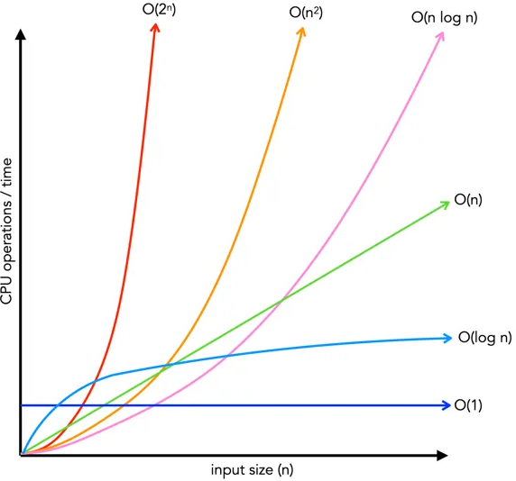

# Complejidad algorítmica

Algoritmos y Estructuras de Datos (CB100) - FIUBA  
Martin Klöckner - [mklockner@fi.uba.ar](mailto:mklockner@fi.uba.ar)  

Se dice que un algorítmico es mas eficiente que otro si consume menos recursos,
o se ejecuta mas rápido. La eficiencia se puede medir en términos espaciales
(cantidad de memoria estática y dinámica que utiliza al ejecutarse) o en
términos temporales (el tiempo que tarda en ejecutarse) en general se busca una
relación de compromiso que comprende ambos factores.

Cuando se hace un análisis de la complejidad temporal de un algoritmo, se hace
referencia al tamaño de entrada del problema, o tamaño del problema, este tamaño
depende de la naturaleza del problema y corresponde a aquel o aquellos elementos
que produzcan, al crecer, un aumento en el tiempo de ejecución. Por ejemplo, al
calcular el factorial de un número, el tamaño del problema es el número al cual
se quiere calcular el factorial, ya que cuanto mayor sea este número mayor será
el tiempo de ejecución del algoritmo, otro ejemplo es el caso de una búsqueda
binaria en la cual el tamaño del problema será el tamaño del vector a ordenar.

Se denota entonces el coste real para una operación de $n$ entradas como $T(n)$,
esta coste mide el número de operaciones elementales requeridas para ejecutar el
algoritmo que se describe, y si bien al analizar un algoritmo existe un mejor
caso, un caso promedio y un peor caso, en la practica se suele definir a $T(n)$
en términos del peor caso, ya que determina cual sería el número de operaciones
elementales requeridas con la peor entrada posible. Por ejemplo en el siguiente
caso, la cantidad de ciclos ejecutados depende directamente de la posición del
dato en el vector, en el mejor caso es $1$ y es cuando el dato está en el primer
elemento, el caso promedio, es un promedio ponderado entre las probabilidades de
todas las posibles entradas, en este caso resulta $n/2$, el peor caso es cuando
está al final, y en ese caso la cantidad de operaciones elementales requeridas
es $n$, por esto ultimo la complejidad algorítmica $T(n)$ resulta $n$,
denotándose $T(n) = n$.

```c++
int get_pos(int* vec, int len, int data) {
    for(int pos = 0; pos < len; ++pos) {
        if(vec[i] == data) {
            return pos;
        }
    }
    return -1;
}
```

## Operaciones elementales

Las operaciones elementales son aquellas operaciones básicas de bajo nivel que
un algoritmo ejecuta y que tienen un costo constante (es decir, toman el mismo
tiempo, independientemente del tamaño de la entrada). Se considera operaciones
elementales a las operaciones aritméticas básicas (`+`, `-`, `*`, etc),
comparaciones lógicas (`==`, `!=`, `>`, etc), transferencias de control,
asignaciones a variables de tipos básicos (`x = 5`, `a = b`, etc), acceso a
memoria (`a[i]`, `x = b`, etc).

Las operaciones elementales sirven para independizar la definición de la
complejidad de un algoritmo de la maquina en la cual se ejecuta, ya que la
diferencia será una constante relacionada a la rapidez con la cual la maquina en
la cual se ejecuta el algoritmo puede realizar dichas operaciones elementales.

```c++
int a;      // 1 operación elemental
a = 5;      // 1 operación elemental
a = a + 5;  // 2 OE (acceso a memoria y suma) 
```

En el ejemplo anterior la complejidad algorítmica resulta $T(n) = 4$ y es
constante independiente de la entrada (no tiene entrada). En el ejemplo
siguiente la entrada es $n$.


```c++
int n;          // 1 operación elemental
std::cin >> n;  // se considera 1 OE

while(n > 0) {
    std::cout << n; // se considera 1 OE
    n--;            // 2 OE
}
```

El número total de operaciones elementales en el mejor de los casos es $2$ y es
cuando la entrada es $n <= 0$, en el peor de los caso se puede ver que el ciclo
`while` se ejecuta $n$ veces, resultando la complejidad algorítmica $T(n) = 2 +
n*3$.

En el siguiente ejemplo hay una condición y en una de las ramas un ciclo
`while`, ante estos casos se toma el peor caso, por lo tanto el coste total
resulta $T(n) = 4 + 3*n$, ya que es el coste del ciclo.

```c++
int n;          // 1 operacion elemental
std::cin >> n;  // 1 OE

if(n % 2 == 0) {     // 2 OE
    std::cout << n;  // 1 OE
} else {
    while(n > 0) {
        std::cout << n;  // 1 OE
        n--;             // 2 OE
    }
}
```

## Complejidad asintótica

La complejidad asintótica describe cómo crece el tiempo o espacio requerido por
un algoritmo cuando aumenta el tamaño de la entrada, ignorando constantes y
detalles menores. Esto se define debido a que en muchos casos calcular el costo
en operaciones elementales puede volverse tedioso, por lo que una mejor
aproximación es acotar apropiadamente el costo de ejecución del algoritmo. Por
ejemplo, se tiene el costo en función de la entrada de dos algoritmos $T_{1}(n)$
y $T_{2}(n)$:

$$T_{1}(n) = 3n^2 + 5n + 6\hspace{2em} T_{2}(n) = 12n^2 + 2$$

Se puede decir entonces, que ambos algoritmos tienen una complejidad similar en
términos de cotas, ya que para un número suficientemente grande de la entrada,
ambos algoritmos tienden a crecer de forma cuadrática.

Para acotar debidamente un algoritmo se definen 3 cotas, la cota superior, la
cota inferior y la cota mas ajustada o que aproxima mejor entre la cota
superior e inferior. 

### Cota inferior $\Omega$

La cota inferior (Omega $\Omega$) hace referencia a una función que acota
inferiormente al tiempo real $T(n)$ de un algoritmo dado, es decir, indica que
función será siempre superada por $T(n)$ para un $n$ suficientemente grande. 

### Cota que mejor aproxima $\Theta$

La cota que mejor aproxima (Theta $\Theta$) hace referencia a una funcion que
acota tanto inferiormente como superiormente al tiempo real $T(n)$ de un
algoritmo dado para un $n$ suficientemente grande.

### Cota superior $\mathcal{O}$

La cota superior hace referencia a una función que acota el crecimiento del
número de operaciones elementales o tiempo de ejecución de un algoritmo en el
**peor de los casos** para un número de entradas suficientemente grande, esto es
la minima función, ya que existen infinitas funciones que pueden ser mayores o
que pueden acotar el crecimiento de tiempo del algoritmo.

Por ejemplo para la siguiente función de tiempo real para un algoritmo dado
$T_{1}(n) = 3n^2 + 5n + 6$, se tiene que una cota superior es $O(n) = n^2$, ya
que para un número suficientemente grande el termino lineal y constante no hace
diferencia.

### Orden

El orden expresa el comportamiento dominante de un algoritmo para un número de
entradas $n$ suficientemente grande, en la practica se suele tomar como si fuera
la cota superior, aunque por definición no lo es. Por definición se dice que
$T(n)$ es de orden $g(n)$ (o pertenece a) $\mathcal{O}(g(n))$ si y solo si existen
constantes positivas $c$ y $n_{0}$, tales que se verifica para todo $n > n_{0}$
lo siguiente 

$$0 \leq T(n) \leq c*g(n)\hspace{1em} \forall n \geq n_{0}$$

En general en los casos en donde $T(n)$ se expresa como un polinomio, el orden
$\mathcal{O}$ del algoritmo, es el termino de mayor grado de $T(n)$

Los ordenes mas comunes entre diferentes algoritmos se pueden ordenar en forma
creciente en cuanto a complejidad algorítmica, esto permite comparar la
eficiencia entre los algoritmos:

\begin{align*}
\mathcal{O}(1) &\subset \mathcal{O}(\log n) \subset \mathcal{O}(n) \subset \mathcal{O}(n \log n) \\
&\subset \mathcal{O}(n^2) \subset \mathcal{O}(n^3) \subset \cdots \subset \mathcal{O}(2^n) \subset \mathcal{O}(n!)
\end{align*}



#### Propiedades del orden

A continuación se muestran propiedades de la cota superior $\mathcal{O}(f)$

1. $f$ es $\mathcal{O}(f)$ entonces $f$ esta acotada por su orden
2. $\mathcal{O}(f)$ es $\mathcal{O}(g) \Rightarrow \mathcal{O}(f) \subset \mathcal{O}(g)$ y $\mathcal{O}(g) \subset \mathcal{O}(f)$
3. $\mathcal{O}(f) = \mathcal{O}(g)$ $\Leftrightarrow$ $f$ es $\mathcal{O}(g)$ y $g$ es
   $\mathcal{O}(f)$
4. Si $f$ es $\mathcal{O}(g)$ y $g$ es $\mathcal{O}(h)$ $\Rightarrow$ $f$ es $\mathcal{O}(h)$
5. Si $f$ es $\mathcal{O}(g)$ y $f$ es $\mathcal{O}(h)$ $\Rightarrow$ $f$ es $\mathcal{O}(min(g, h))$
6. Si $f_{1}$ es $\mathcal{O}(g)$ y $f_{2}$ es $\mathcal{O}(h)$
   $\Rightarrow$ $f_{1} + f_{2}$ es $\mathcal{O}(max(g, h))$
7. Si $f_{1}$ es $\mathcal{O}(g)$ y $f_{2}$ es $\mathcal{O}(h)$
   $\Rightarrow$ $f_{1} * f_{2}$ es $\mathcal{O}(g*h)$

## Algoritmos recursivos

Dado una función de costo real con recurrencia (es decir que depende de la misma
función para términos anteriors) por ejemplo $T(n) = T(n-1) + 1$ se puede hallar
la complejidad mediante dos métodos gentales, el primero el método de expansion,
en el cual se trata de un método iterativo evaluando como depende la función con
las iteraciones, y en el segundo método de resolución, aplicando el teorema
maestro, el cual es una formula general.

### Método de expansión

El método de expansion se trata de ir hallando los términos recursivos mediante
la formula del coste real $T(n)$ y reemplazando en si misma, es un proceso
iterativo. Por ejemplo se tiene una expresión de $T(n)$:

$$\begin{align}
T(n) = 2T\left(\frac{n}{2}\right) + \mathcal{O}(1)
\end{align}$$

De la ecuación anterior se puede obtener $T\left(\frac{n}{2}\right)$
reemplazando $n$ con $n/2$:

$$\begin{align}
T\left(\frac{n}{2}\right) = 2T\left(\frac{n}{4}\right) +
\mathcal{O}(1)
\end{align}$$

Por lo tanto reemplazando $(2)$ en $(1)$ resulta:

$$\begin{align}
T(n) &= 2\cdotp \left[2T\left(\frac{n}{4}\right) + \mathcal{O}(1)\right] + \mathcal{O}(1) \nonumber\\
     &= 4T\left(\frac{n}{4}\right) + 2\mathcal{O}(1) + \mathcal{O}(1) \nonumber\\
     &= 4T\left(\frac{n}{4}\right) + 3\mathcal{O}(1)
\end{align}$$

Pero de $(1)$ también se puede obtener $T\left(\frac{n}{4}\right)$:

$$\begin{align}
T\left(\frac{n}{4}\right) = 2T\left(\frac{n}{8}\right) + \mathcal{O}(1)
\end{align}$$

Y reemplazando $(4)$ en la ecuación $(3)$:

$$\begin{align}
T(n) &= 4\cdotp \left[2T\left(\frac{n}{8}\right) + \mathcal{O}(1)\right]  + 2\mathcal{O}(1) + \mathcal{O}(1) \nonumber\\
     &= 8T\left(\frac{n}{8}\right) + 4\mathcal{O}(1) + 2\mathcal{O}(1) + \mathcal{O}(1)\nonumber\\
     &= 8T\left(\frac{n}{8}\right) + 7\mathcal{O}(1)
\end{align}$$

Se puede ver que luego de realizar $k$ veces el mismo procedimiento resulta:

$$\begin{align}
T(n) = 2^{k}\cdotp T\left(\frac{n}{2^k}\right) + (2^{k}-1)\cdotp \mathcal{O}(1)
\end{align}$$

Pero las iteraciones se terminan cuando el numero de entradas es $1$, entonces
en $(6)$:

$$\begin{align}
\frac{n}{2^k} = 1 \Rightarrow n = 2^k \Rightarrow \boxed{log_{2}(n) = k}
\end{align}$$

Con $(7)$ en $(6)$ resulta

$$T(n) = n\cdotp T(1) + (n - 1)\cdotp \mathcal{O}(1)$$

De la expresión anterior, suponiendo $T(1) = \mathcal{O}(1)$ y aproximando, resulta

$$\begin{align*}
T(n) &= n\cdotp \mathcal{O}(1) + (n - 1)\cdotp \mathcal{O}(1) \\
     &= \mathcal{O}(n) + \mathcal{O}(n) \Rightarrow \boxed{T(n)     = \mathcal{O}(n)}
\end{align*}$$

Es decir la complejidad resulta $\mathcal{O}(n)$. El mismo problema se podría haber

### Teorema maestro

El teorema maestro se trata de una solución general para hallar la complejidad
dependiendo de como evolucionan los términos, en general se tienen dos forums,
la forma lineal, o por sustracción y la forma por division, las diferencias o
cuando aplicar cada una se muestran a continuación.

#### Reducción por sustracción

Dado una función de costo real $T(n)$ de la forma

$$T(n) = a\cdotp T(n-b)+\mathcal{O}(n^{k})$$

Entonces la complejidad algorítmica, o la solución de la ecuación de recurrencia
$T(n)$ resulta:

$$T(n) = 
\begin{cases}
\hspace{0.75em} \mathcal{O}(n^{(n/b)}\cdotp n^{k}) & \text{si } a > 1 \\
\hspace{0.75em} \mathcal{O}(n^{k+1})               & \text{si } a = 1 \\
\hspace{0.75em} \mathcal{O}(n^k)                   & \text{si } a < 1
\end{cases}$$

#### Reducción por division

Dado una función de costo real $T(n)$ de la forma

$$T(n) = 
\begin{cases}
\hspace{0.75em} c\cdotp n^{k}                                     & \text{si } 1 \leq n < b \\
\hspace{0.75em} a\cdotp T\left(\frac{n}{b}\right) + c\cdotp n^{k} & \text{si } n \geq b
\end{cases}$$

Entonces la complejidad algorítmica, o la solución de la ecuación de recurrencia
$T(n)$ resulta:

$$T(n) = 
\begin{cases}
\hspace{0.75em} \mathcal{O}(n^k)                & \text{si } a < b^{k} \\
\hspace{0.75em} \mathcal{O}(n^{k}\cdotp log(n)) & \text{si } a = b^{k} \\
\hspace{0.75em} \mathcal{O}(n^{log_{b}(a)})     & \text{si } a > b^{k}
\end{cases}$$

\vspace{-0.5em}

## Complejidad amortizada

Cuando se mide la complejidad de un algoritmo mediante el peor caso
($\mathcal{O}$) puede haber casos en los que no sea representativo, es decir, el
peor caso dista mucho de la media de ejecución del algoritmo, por lo que se usa
la **complejidad amortizada** la cual es una especie de promedio por operación
de un algoritmo en el peor de los casos a lo largo de una serie de operaciones. 

Por definición la complejidad amortizada es una técnica de análisis que se
utiliza para determinar el tiempo promedio por operación de un algoritmo en el
peor de los casos a lo largo de una secuencia de operaciones. En lugar de
analizar el tiempo proporciona una estimación del costo total de una serie de
operaciones, dividiendo este costo total por el numero de operaciones. Este tipo
de análisis es especialmente útil cuando ciertas operaciones pueden ser muy
costosas individualmente, pero esas operaciones costosas ocurren con poca
frecuencia.

Existen varios métodos para realizar un análisis amortizado, pero el mas común
es calcular el costo total de una secuencia de operaciones y dividir por el
numero total de operaciones:

$$\boxed{\text{Costo amortizado } = \frac{T(n)}{n}}$$
